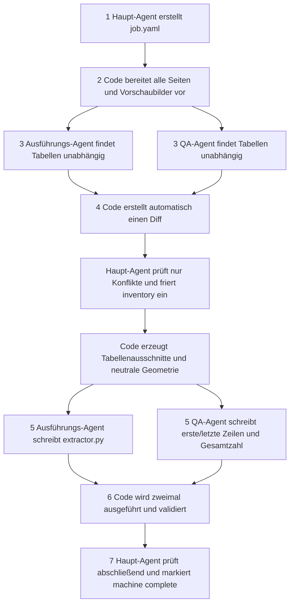

# 让 Agent 生成 PDF 表格提取器

`pdf-table-codegen` 生成项目内可重复运行的 `extractor.py`。AI 只参与一次性的
表格发现、QA 样本转录和代码编写；后续流水线只运行 Python 代码。

## 三种 Agent 与代码的职责

- 主 Agent：创建任务、只复核清单冲突、执行最终检查。
- 执行 Agent：独立寻找表格，冻结后编写提取代码。
- QA Agent：独立寻找表格，只从原始证据写首尾行等参考值，不看提取代码或输出。
- 确定性代码：准备缩略图、比较清单、冻结产物、裁剪、双运行验证和失效管理。

这样既保留不同 PDF 的适配性，也避免提取器用自己的结果证明自己正确。

## 七阶段流程



原文档里的表格合并、拆分和误检删除放在第 4 阶段、inventory 冻结之前。
面向业务的输出合并或过滤写进 `job.yaml`，由 `extractor.py` 实现，不能删掉真实源表。

## 安装与命令

```bash
uv tool install ./packages/pdf-table-codegen
pdf-table-codegen install-skill <workspace>

pdf-table-codegen prepare project/job.yaml
pdf-table-codegen compare-inventories \
  project/job.yaml /tmp/inventory-execution.json /tmp/inventory-qa.json
pdf-table-codegen freeze-inventory project/job.yaml /tmp/reconciliation.json
pdf-table-codegen inspect project/job.yaml
pdf-table-codegen freeze-reference project/job.yaml /tmp/reference-qa.json
pdf-table-codegen verify project/job.yaml
pdf-table-codegen finalize project/job.yaml /tmp/final-review.json
```

`run` 只能在 QA reference 冻结后执行。`verify` 会运行提取器两次并检查结果完全一致。
如需修改已冻结的清单或 QA，必须执行 `reopen-inventory` 或 `reopen-reference`；系统会明确
删除所有失效的下游产物。验证后再次执行 `run` 也会令旧验证和最终检查失效，必须重新执行
`verify` 与 `finalize`。每条 CLI 输出都包含 `elapsed_seconds`。

## 项目结构

```text
project/
├── job.yaml
├── extractor.py
├── evidence/
│   ├── workflow.json
│   ├── manifest.json
│   ├── inventory-diff.json
│   ├── inventory-reconciliation.json
│   ├── inventory.frozen.json
│   ├── visual-reference.json
│   ├── final-review.json
│   ├── contacts/ pages/ geometry/
│   └── tables/
└── output/
    ├── <table-id>.csv
    ├── result.json
    └── verification.json
```

临时 inventory/reference 草稿必须放在项目外。冻结产物带有来源和上游哈希，QA reference
不能被提取器读取，也不能用来拼装提取结果。

## 灵活提取，而非固定模板

package 只固定工作流、接口、溯源和校验，不固定表格算法。执行 Agent 可以逐表混用行带与
列边界、锚点聚类、矢量单元格、层级状态机，或仅对文字层失效区域使用 OCR。每种方法都要
提供对应的锚点、关键列、跨页边界或坐标漂移断言；只匹配行列数不算验证通过。

```python
from pdf_table_codegen import ExtractionRequest
from my_pdf_project.extractor import extract_tables

result = extract_tables(ExtractionRequest(source=input_pdf))
```

运行边界是 `ExtractionRequest -> ExtractionResult`，CSV 只是默认序列化格式。
